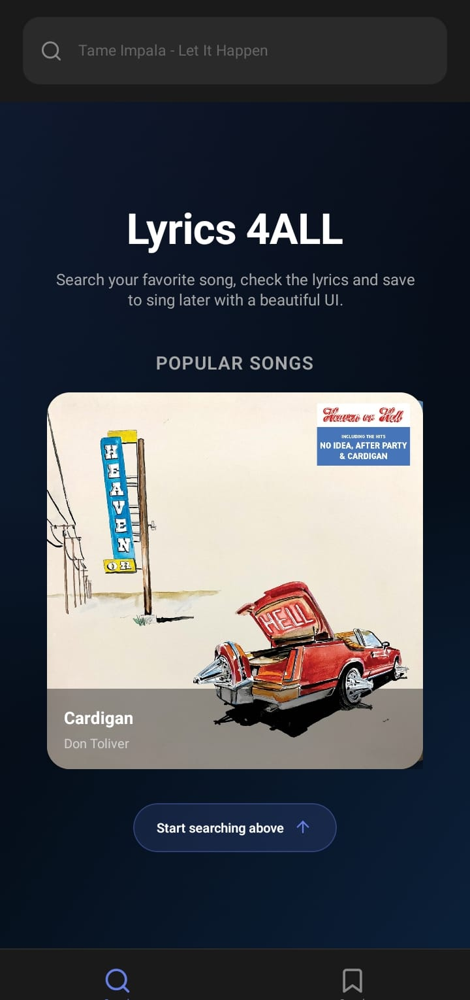
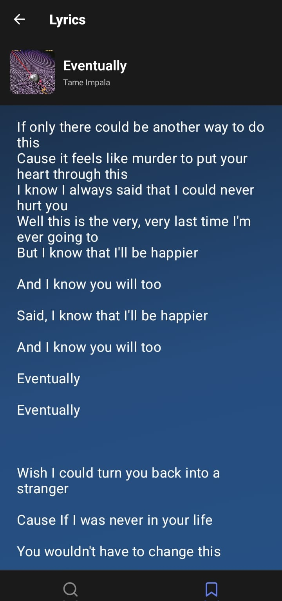
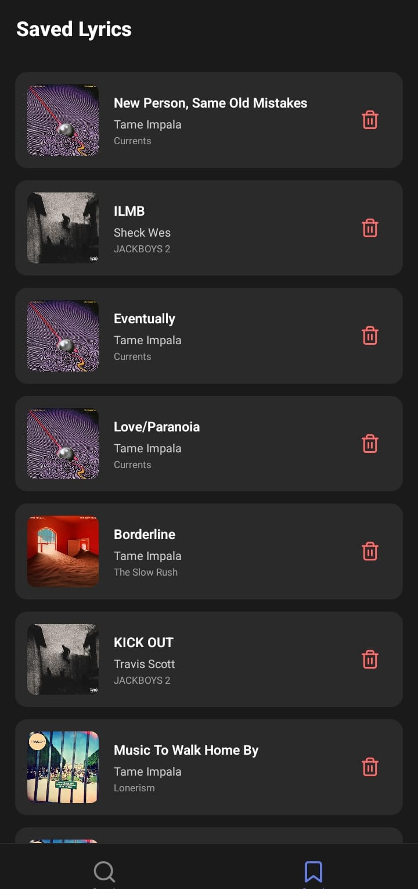

# Lyric finder 🎵

The app allows you to search for your favorite songs and displays the cover art along with the full lyrics. You can save any lyric by tapping the save button, and it will then appear in the Saved Lyrics tab.

This app was developed using Expo Go and Android Studio for the build process, with JavaScript and React Native.

## Screenshots

  
  
   

